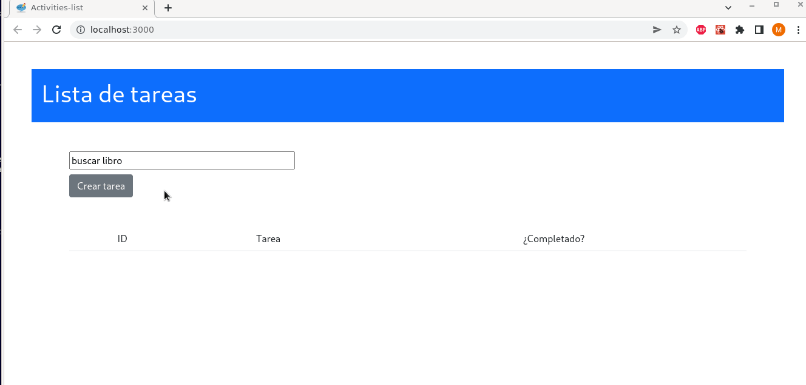
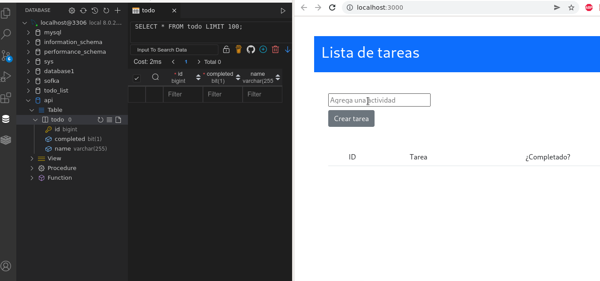
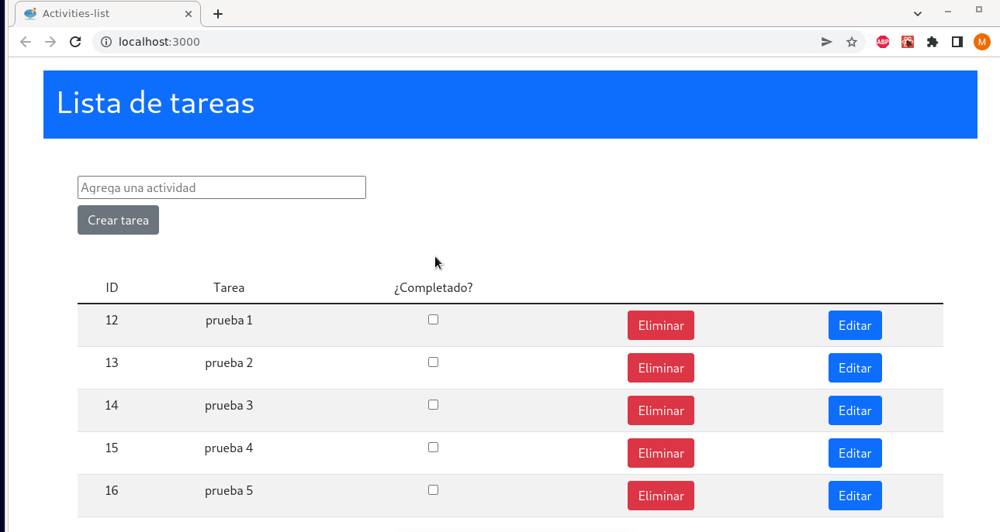
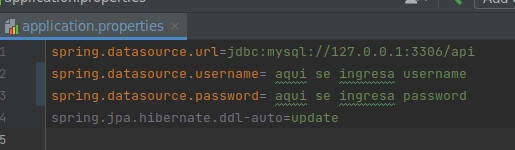

# KATA-API-CRUD

### Demo:

### A continuación se presentan las mejoras hechas al proyecto:

#### 1) Se almacenan los datos del API en el servidor local mySQL

#### 2) Se agrega checkbox que permite actualizar si la actidad se encuentra completada o no.

#### 3) Adicionalmente en el front se edita el estilo y se ordena el proyecto por componentes.

### Aclaraciones de uso:

#### 1) Puedes usar el comando -> git clone https://github.com/Pilar89/KATA-API-CRUD.git para clonar el proyecto en tu equipo.

#### - Para la carpeta  front
#### 1) Para instalar las dependencias, en el directorio del proyecto usa el comando -> npm install
#### 2) Para correr el proyecto -> npm run
#### 3) Abrir [http://localhost:3000] en el navegador, donde correrá el proyecto

#### - Para la carpeta  front

#### 1) Si se va a trabajar con MySQL local se recomienda ingresar a la carpeta src -> main -> resources -> application.properties y modificar el siguiente archivo según corresponda:

